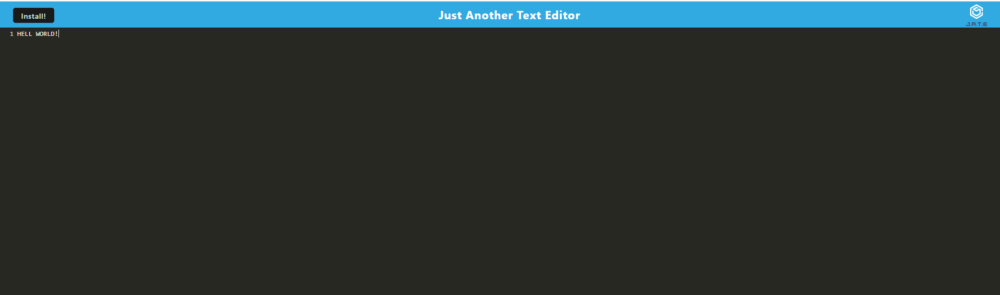
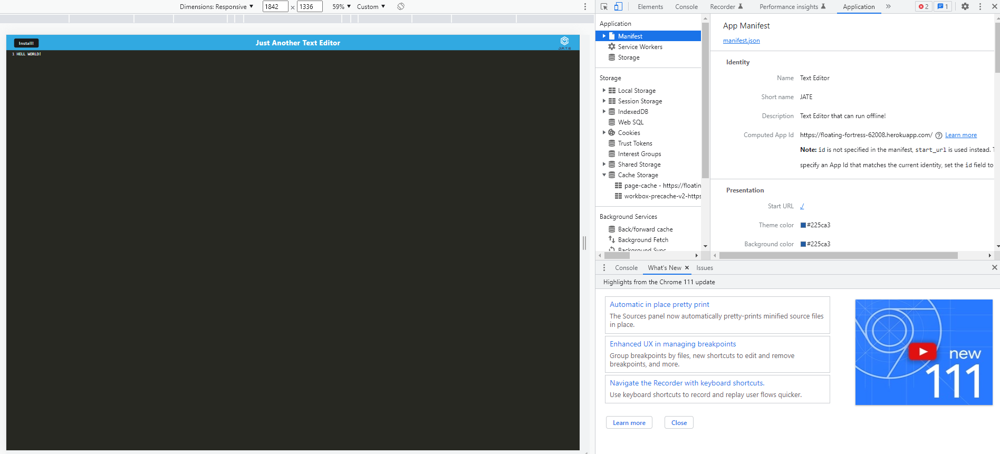
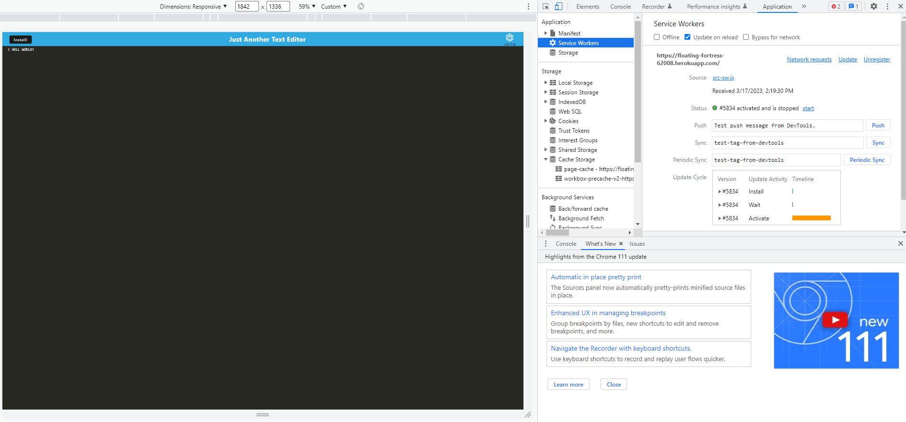
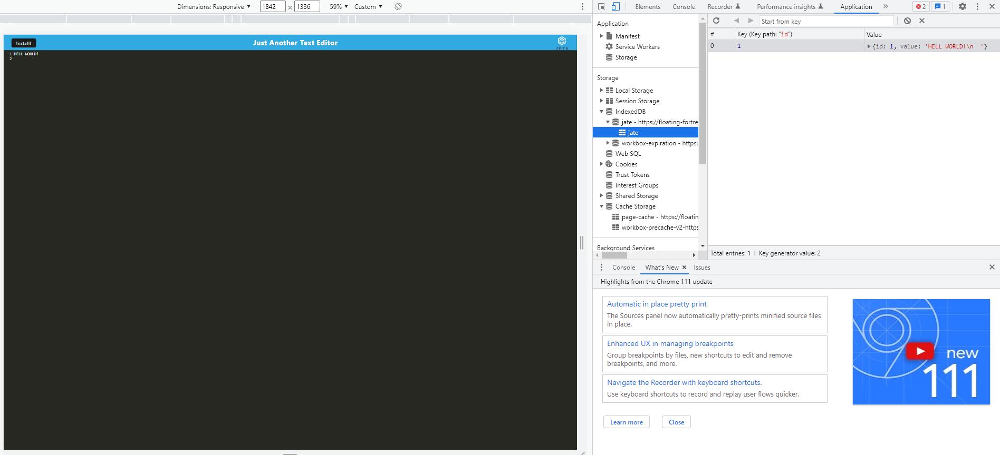

# Text Editor

## Description
The following challenge involved working with started code that will meet PWA criteria. Additionally, it will feature a number of data persistence techniques that serve as redundancy in case one of the options is not supported by the browser. The application will also function offline. The application is basic text editor that runs in the browser that can also be downloaded. 

Link to live Application: https://floating-fortress-62008.herokuapp.com/

## Installation

Please install libraries and run on a console. Repo does not include any seed data.

The application will be invoked by using the following command:

npm build

npm start

## Technologies Used

- Node.js
- Babel
- Webpack
- Idb
- Cpncurrently
## License

none
